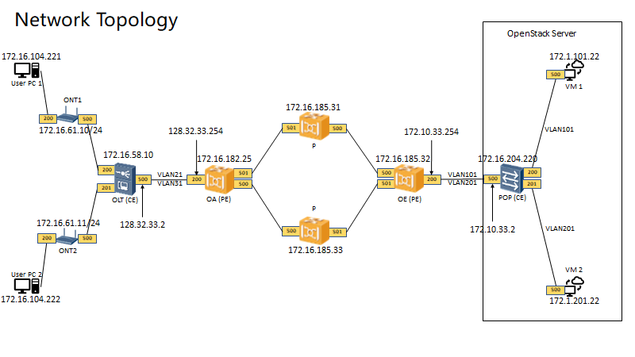

# Instructions for creating network slices for POC Phase 2

## Network Topology and Architecture of IETF Network Slice Model mapping to App-flow and L3VPN used in this demo


## Demo Steps
The demo steps order is:
1. PC1 connects to VM1 (i.e., User of PC1 plays game on VM1)
2. PC2 connects to VM1 (i.e., User of PC2 plays game on VM1)
3. PC1 connects to VM2 (i.e., User of PC1 plays game on VM2)
4. PC2 connects to VM2 (i.e., User of PC2 plays game on VM2)
5. PC1 disconnects to VM1 (i.e., User of PC1 stops playing game on VM1)
6. PC2 disconnects to VM1 (i.e., User of PC2 stops playing game on VM1)
7. PC1 disconnects to VM2 (i.e., User of PC1 stops playing game on VM2)
8. PC2 disconnects to VM2 (i.e., User of PC2 stops playing game on VM2)

## RESTCONF Operations
### Operation 0: Create the top-level (empty) container
1. **URL:** `http://<e2e-tfs-server>/restconf/data`

   **Method:** POST

   **Payload:**
   ```json
    {
      "ietf-network-slice-service:network-slice-services": {}
    }

### Operation 1: PC1 connects to VM1 (i.e., User of PC1 plays game on VM1)
1. **URL:** `http://<e2e-tfs-server>/restconf/data/ietf-network-slice-service:network-slice-services`

   **Method:** POST

   **Header:** `Content-Type: application/json`

   **Payload:**
   ```json

    {
        "slice-service": [
            {
                "id": "slice1",
                "description": "network slice 1, connect to VM1",
                "sdps": {
                    "sdp": [
                        {
                            "id": "1",
                            "node-id": "172.16.204.220",
                            "sdp-ip-address": [
                                "172.16.204.220"
                            ],
                            "service-match-criteria": {
                                "match-criterion": [
                                    {
                                        "index": 1,
                                        "match-type": [
                                            {
                                                "type": "ietf-network-slice-service:vlan",
                                                "value": [
                                                    "101"
                                                ]
                                            },
                                            {
                                                "type": "ietf-network-slice-service:destination-ip-prefix",
                                                "value": [
                                                    "172.16.104.221/24"
                                                ]
                                            },
                                            {
                                                "type": "ietf-network-slice-service:destination-tcp-port",
                                                "value": [
                                                    "10500"
                                                ]
                                            },
                                            {
                                                "type": "ietf-network-slice-service:source-ip-prefix",
                                                "value": [
                                                    "172.1.101.22/24"
                                                ]
                                            },
                                            {
                                                "type": "ietf-network-slice-service:source-tcp-port",
                                                "value": [
                                                    "10200"
                                                ]
                                            }
                                        ],
                                        "target-connection-group-id": "line1"
                                    }
                                ]
                            },
                            "attachment-circuits": {
                                "attachment-circuit": [
                                    {
                                        "id": "AC POP to VM1",
                                        "description": "AC VM1 connected to POP",
                                        "ac-node-id": "172.16.204.220",
                                        "ac-tp-id": "200"
                                    }
                                ]
                            }
                        },
                        {
                            "id": "2",
                            "node-id": "172.16.61.10",
                            "sdp-ip-address": [
                                "172.16.61.10"
                            ],
                            "service-match-criteria": {
                                "match-criterion": [
                                    {
                                        "index": 1,
                                        "match-type": [
                                            {
                                                "type": "ietf-network-slice-service:vlan",
                                                "value": [
                                                    "21"
                                                ]
                                            },
                                            {
                                                "type": "ietf-network-slice-service:source-ip-prefix",
                                                "value": [
                                                    "172.16.104.221/24"
                                                ]
                                            },
                                            {
                                                "type": "ietf-network-slice-service:source-tcp-port",
                                                "value": [
                                                    "10500"
                                                ]
                                            },
                                            {
                                                "type": "ietf-network-slice-service:destination-ip-prefix",
                                                "value": [
                                                    "172.1.101.22/24"
                                                ]
                                            },
                                            {
                                                "type": "ietf-network-slice-service:destination-tcp-port",
                                                "value": [
                                                    "10200"
                                                ]
                                            }
                                        ],
                                        "target-connection-group-id": "line1"
                                    }
                                ]
                            },
                            "attachment-circuits": {
                                "attachment-circuit": [
                                    {
                                        "id": "AC ONT",
                                        "description": "AC connected to PC1",
                                        "ac-node-id": "172.16.61.10",
                                        "ac-tp-id": "200"
                                    }
                                ]
                            }
                        }
                    ]
                },
                "connection-groups": {
                    "connection-group": [
                        {
                            "id": "line1",
                            "connectivity-type": "point-to-point",
                            "connectivity-construct": [
                                {
                                    "id": 1,
                                    "p2p-sender-sdp": "1",
                                    "p2p-receiver-sdp": "2",
                                    "service-slo-sle-policy": {
                                        "slo-policy": {
                                            "metric-bound": [
                                                {
                                                    "metric-type": "ietf-network-slice-service:one-way-delay-maximum",
                                                    "metric-unit": "milliseconds",
                                                    "bound": "10"
                                                },
                                                {
                                                    "metric-type": "ietf-network-slice-service:one-way-bandwidth",
                                                    "metric-unit": "Mbps",
                                                    "bound": "5000"
                                                },
                                                {
                                                    "metric-type": "ietf-network-slice-service:two-way-packet-loss",
                                                    "metric-unit": "percentage",
                                                    "percentile-value": "0.001"
                                                }
                                            ]
                                        }
                                    }
                                },
                                {
                                    "id": 2,
                                    "p2p-sender-sdp": "2",
                                    "p2p-receiver-sdp": "1",
                                    "service-slo-sle-policy": {
                                        "slo-policy": {
                                            "metric-bound": [
                                                {
                                                    "metric-type": "ietf-network-slice-service:one-way-delay-maximum",
                                                    "metric-unit": "milliseconds",
                                                    "bound": "20"
                                                },
                                                {
                                                    "metric-type": "ietf-network-slice-service:one-way-bandwidth",
                                                    "metric-unit": "Mbps",
                                                    "bound": "1000"
                                                },
                                                {
                                                    "metric-type": "ietf-network-slice-service:two-way-packet-loss",
                                                    "metric-unit": "percentage",
                                                    "percentile-value": "0.001"
                                                }
                                            ]
                                        }
                                    }
                                }
                            ]
                        }
                    ]
                }
            }
        ]
    }

2. **URL:** `http://<nce-server>/restconf/v1/data/app-flows/apps`

   **Method:** POST

   **Header:** `Content-Type: application/json`

   **Payload:**
   ```json
    {
      "application": [
        {
          "app-features": {
            "app-feature": [
              {
                "dest-ip": "172.1.101.22",
                "dest-port": "10200",
                "id": "feature_2_1_slice1",
                "protocol": "tcp",
                "src-ip": "172.16.104.221",
                "src-port": "10500"
              }
            ]
          },
          "app-id": "app_2_1_slice1",
          "name": "App_Flow_2_1_slice1"
        }
      ]
    }

3. **URL:** `http://<nce-server>/restconf/v1/data/app-flows`

   **Method:** POST

   **Header:** `Content-Type: application/json`

   **Payload:**
   ```json
    {
      "app-flow": [
        {
          "app-name": "App_Flow_2_1_slice1",
          "duration": 9999,
          "max-online-users": 1,
          "name": "App_Flow_2_1_slice1",
          "qos-profile": "AR_VR_Gaming",
          "service-profile": "service_2_1_slice1",
          "stas": "00:3D:E1:18:82:9E",
          "user-id": "a8b5b840-1548-46c9-892e-5c18f9ec8d99"
        }
      ]
    }

4. **URL:** `http://<ip-tfs-server>/restconf/data/ietf-l3vpn-svc:l3vpn-svc/vpn-services`

   **Method:** POST

   **Header:** `Content-Type: application/json`

   **Payload:**
   ```json
    {
      "ietf-l3vpn-svc:l3vpn-svc": {
        "sites": {
          "site": [
            {
              "devices": {
                "device": [
                  {
                    "device-id": "172.16.185.32",
                    "location": "cloud"
                  }
                ]
              },
              "locations": {
                "location": [
                  {
                    "location-id": "cloud"
                  }
                ]
              },
              "management": {
                "type": "ietf-l3vpn-svc:provider-managed"
              },
              "routing-protocols": {
                "routing-protocol": [
                  {
                    "static": {
                      "cascaded-lan-prefixes": {
                        "ipv4-lan-prefixes": [
                          {
                            "lan": "172.16.104.221/24",
                            "lan-tag": "101",
                            "next-hop": "172.10.33.254"
                          }
                        ]
                      }
                    },
                    "type": "ietf-l3vpn-svc:static"
                  }
                ]
              },
              "site-id": "site_cloud",
              "site-network-accesses": {
                "site-network-access": [
                  {
                    "device-reference": "172.16.185.32",
                    "ip-connection": {
                      "ipv4": {
                        "address-allocation-type": "ietf-l3vpn-svc:static-address",
                        "addresses": {
                          "customer-address": "172.10.33.254",
                          "prefix-length": "24",
                          "provider-address": "172.10.33.254"
                        }
                      }
                    },
                    "service": {
                      "qos": {
                        "qos-profile": {
                          "classes": {
                            "class": [
                              {
                                "bandwidth": {
                                  "guaranteed-bw-percent": 100
                                },
                                "class-id": "qos-realtime",
                                "direction": "ietf-l3vpn-svc:both",
                                "latency": {
                                  "latency-boundary": 20
                                }
                              }
                            ]
                          }
                        }
                      },
                      "svc-input-bandwidth": 5000000000,
                      "svc-mtu": 1500,
                      "svc-output-bandwidth": 1000000000
                    },
                    "site-network-access-id": "200",
                    "site-network-access-type": "ietf-l3vpn-svc:multipoint",
                    "vpn-attachment": {
                      "site-role": "ietf-l3vpn-svc:hub-role",
                      "vpn-id": "slice1"
                    }
                  }
                ]
              }
            },
            {
              "devices": {
                "device": [
                  {
                    "device-id": "172.16.182.25",
                    "location": "access"
                  }
                ]
              },
              "locations": {
                "location": [
                  {
                    "location-id": "access"
                  }
                ]
              },
              "management": {
                "type": "ietf-l3vpn-svc:provider-managed"
              },
              "routing-protocols": {
                "routing-protocol": [
                  {
                    "static": {
                      "cascaded-lan-prefixes": {
                        "ipv4-lan-prefixes": [
                          {
                            "lan": "172.1.101.22/24",
                            "lan-tag": "21",
                            "next-hop": "128.32.33.254"
                          }
                        ]
                      }
                    },
                    "type": "ietf-l3vpn-svc:static"
                  }
                ]
              },
              "site-id": "site_access",
              "site-network-accesses": {
                "site-network-access": [
                  {
                    "device-reference": "172.16.182.25",
                    "ip-connection": {
                      "ipv4": {
                        "address-allocation-type": "ietf-l3vpn-svc:static-address",
                        "addresses": {
                          "customer-address": "128.32.33.254",
                          "prefix-length": "24",
                          "provider-address": "128.32.33.254"
                        }
                      }
                    },
                    "service": {
                      "qos": {
                        "qos-profile": {
                          "classes": {
                            "class": [
                              {
                                "bandwidth": {
                                  "guaranteed-bw-percent": 100
                                },
                                "class-id": "qos-realtime",
                                "direction": "ietf-l3vpn-svc:both",
                                "latency": {
                                  "latency-boundary": 10
                                }
                              }
                            ]
                          }
                        }
                      },
                      "svc-input-bandwidth": 1000000000,
                      "svc-mtu": 1500,
                      "svc-output-bandwidth": 5000000000
                    },
                    "site-network-access-id": "200",
                    "site-network-access-type": "ietf-l3vpn-svc:multipoint",
                    "vpn-attachment": {
                      "site-role": "ietf-l3vpn-svc:spoke-role",
                      "vpn-id": "slice1"
                    }
                  }
                ]
              }
            }
          ]
        },
        "vpn-services": {
          "vpn-service": [
            {
              "vpn-id": "slice1"
            }
          ]
        }
      }
    }

### Operation 2: PC2 connects to VM1 (i.e., User of PC2 plays game on VM1)
1. **URL:** `http://<e2e-tfs-server>/restconf/data/ietf-network-slice-service:network-slice-services/slice-service=slice1/sdps`

   **Method:** POST

   **Header:** `Content-Type: application/json`

   **Payload:**
   ```json
    {
        "sdp": [
            {
                "id": "3",
                "node-id": "172.16.61.11",
                "sdp-ip-address": [
                    "172.16.61.11"
                ],
                "service-match-criteria": {
                    "match-criterion": [
                        {
                            "index": 1,
                            "match-type": [
                                {
                                    "type": "ietf-network-slice-service:vlan",
                                    "value": [
                                        "21"
                                    ]
                                },
                                {
                                    "type": "ietf-network-slice-service:source-ip-prefix",
                                    "value": [
                                        "172.16.104.222/24"
                                    ]
                                },
                                {
                                    "type": "ietf-network-slice-service:source-tcp-port",
                                    "value": [
                                        "10500"
                                    ]
                                },
                                {
                                    "type": "ietf-network-slice-service:destination-ip-prefix",
                                    "value": [
                                        "172.1.101.22/24"
                                    ]
                                },
                                {
                                    "type": "ietf-network-slice-service:destination-tcp-port",
                                    "value": [
                                        "10200"
                                    ]
                                }
                            ],
                            "target-connection-group-id": "line2"
                        }
                    ]
                },
                "attachment-circuits": {
                    "attachment-circuit": [
                        {
                            "id": "AC ONT",
                            "description": "AC connected to PC2",
                            "ac-node-id": "172.16.61.11",
                            "ac-tp-id": "200"
                        }
                    ]
                }
            }
        ]
    }


2. **URL:** `http://<e2e-tfs-server>/restconf/data/ietf-network-slice-service:network-slice-services/slice-service=slice1/connection-groups`

   **Method:** POST

   **Header:** `Content-Type: application/json`

   **Payload:**
   ```json
    {
        "connection-group": [
            {
                "id": "line2",
                "connectivity-type": "point-to-point",
                "connectivity-construct": [
                    {
                        "id": 1,
                        "p2p-sender-sdp": "1",
                        "p2p-receiver-sdp": "3",
                        "service-slo-sle-policy": {
                            "slo-policy": {
                                "metric-bound": [
                                    {
                                        "metric-type": "ietf-network-slice-service:one-way-delay-maximum",
                                        "metric-unit": "milliseconds",
                                        "bound": "10"
                                    },
                                    {
                                        "metric-type": "ietf-network-slice-service:one-way-bandwidth",
                                        "metric-unit": "Mbps",
                                        "bound": "5000"
                                    },
                                    {
                                        "metric-type": "ietf-network-slice-service:two-way-packet-loss",
                                        "metric-unit": "percentage",
                                        "percentile-value": "0.001"
                                    }
                                ]
                            }
                        }
                    },
                    {
                        "id": 2,
                        "p2p-sender-sdp": "3",
                        "p2p-receiver-sdp": "1",
                        "service-slo-sle-policy": {
                            "slo-policy": {
                                "metric-bound": [
                                    {
                                        "metric-type": "ietf-network-slice-service:one-way-delay-maximum",
                                        "metric-unit": "milliseconds",
                                        "bound": "20"
                                    },
                                    {
                                        "metric-type": "ietf-network-slice-service:one-way-bandwidth",
                                        "metric-unit": "Mbps",
                                        "bound": "1000"
                                    },
                                    {
                                        "metric-type": "ietf-network-slice-service:two-way-packet-loss",
                                        "metric-unit": "percentage",
                                        "percentile-value": "0.001"
                                    }
                                ]
                            }
                        }
                    }
                ]
            }
        ]
    }

3. **URL:** `http://<e2e-tfs-server>/restconf/data/ietf-network-slice-service:network-slice-services/slice-service=slice1/sdps/sdp=1/service-match-criteria`

   **Method:** POST

   **Header:** `Content-Type: application/json`

   **Payload:**
   ```json
    {
        "match-criterion": [
            {
                "index": 2,
                "match-type": [
                    {
                        "type": "ietf-network-slice-service:vlan",
                        "value": [
                            "101"
                        ]
                    },
                    {
                        "type": "ietf-network-slice-service:source-ip-prefix",
                        "value": [
                            "172.1.101.22/24"
                        ]
                    },
                    {
                        "type": "ietf-network-slice-service:source-tcp-port",
                        "value": [
                            "10200"
                        ]
                    },
                    {
                        "type": "ietf-network-slice-service:destination-ip-prefix",
                        "value": [
                            "172.16.104.222/24"
                        ]
                    },
                    {
                        "type": "ietf-network-slice-service:destination-tcp-port",
                        "value": [
                            "10500"
                        ]
                    }
                ],
                "target-connection-group-id": "line2"
            }
        ]
    }

4. **URL:** `http://<nce-server>/restconf/v1/data/app-flows/apps`

   **Method:** POST

   **Header:** `Content-Type: application/json`

   **Payload:**
   ```json
    {
      "application": [
        {
          "app-features": {
            "app-feature": [
              {
                "dest-ip": "172.1.101.22",
                "dest-port": "10200",
                "id": "feature_3_1_slice1",
                "protocol": "tcp",
                "src-ip": "172.16.104.222",
                "src-port": "10500"
              }
            ]
          },
          "app-id": "app_3_1_slice1",
          "name": "App_Flow_3_1_slice1"
        }
      ]
    }

5. **URL:** `http://<nce-server>/restconf/v1/data/app-flows`

   **Method:** POST

   **Header:** `Content-Type: application/json`

   **Payload:**
   ```json
    {
      "app-flow": [
        {
          "app-name": "App_Flow_3_1_slice1",
          "duration": 9999,
          "max-online-users": 1,
          "name": "App_Flow_3_1_slice1",
          "qos-profile": "AR_VR_Gaming",
          "service-profile": "service_3_1_slice1",
          "stas": "00:3D:E1:18:82:9E",
          "user-id": "28a1c47b-0179-4ab8-85da-632e6f946491"
        }
      ]
    }

6. **URL:** `http://<ip-tfs-server>/restconf/data/ietf-l3vpn-svc:l3vpn-svc/vpn-services/?????????????`

   **Method:** POST/PUT ????????????

   **Header:** `Content-Type: application/json`

   **Payload:**
   ```json
    {
      "ietf-l3vpn-svc:l3vpn-svc": {
        "sites": {
          "site": [
            {
              "devices": {
                "device": [
                  {
                    "device-id": "172.16.185.32",
                    "location": "cloud"
                  }
                ]
              },
              "locations": {
                "location": [
                  {
                    "location-id": "cloud"
                  }
                ]
              },
              "management": {
                "type": "ietf-l3vpn-svc:provider-managed"
              },
              "routing-protocols": {
                "routing-protocol": [
                  {
                    "static": {
                      "cascaded-lan-prefixes": {
                        "ipv4-lan-prefixes": [
                          {
                            "lan": "172.16.104.221/24",
                            "lan-tag": "101",
                            "next-hop": "172.10.33.254"
                          }
                        ]
                      }
                    },
                    "type": "ietf-l3vpn-svc:static"
                  }
                ]
              },
              "site-id": "site_cloud",
              "site-network-accesses": {
                "site-network-access": [
                  {
                    "device-reference": "172.16.185.32",
                    "ip-connection": {
                      "ipv4": {
                        "address-allocation-type": "ietf-l3vpn-svc:static-address",
                        "addresses": {
                          "customer-address": "172.10.33.254",
                          "prefix-length": "24",
                          "provider-address": "172.10.33.254"
                        }
                      }
                    },
                    "service": {
                      "qos": {
                        "qos-profile": {
                          "classes": {
                            "class": [
                              {
                                "bandwidth": {
                                  "guaranteed-bw-percent": 100
                                },
                                "class-id": "qos-realtime",
                                "direction": "ietf-l3vpn-svc:both",
                                "latency": {
                                  "latency-boundary": 10
                                }
                              }
                            ]
                          }
                        }
                      },
                      "svc-input-bandwidth": 2000000000,
                      "svc-mtu": 1500,
                      "svc-output-bandwidth": 10000000000
                    },
                    "site-network-access-id": "200",
                    "site-network-access-type": "ietf-l3vpn-svc:multipoint",
                    "vpn-attachment": {
                      "site-role": "ietf-l3vpn-svc:hub-role",
                      "vpn-id": "slice1"
                    }
                  }
                ]
              }
            },
            {
              "devices": {
                "device": [
                  {
                    "device-id": "172.16.182.25",
                    "location": "access"
                  }
                ]
              },
              "locations": {
                "location": [
                  {
                    "location-id": "access"
                  }
                ]
              },
              "management": {
                "type": "ietf-l3vpn-svc:provider-managed"
              },
              "routing-protocols": {
                "routing-protocol": [
                  {
                    "static": {
                      "cascaded-lan-prefixes": {
                        "ipv4-lan-prefixes": [
                          {
                            "lan": "172.1.101.22/24",
                            "lan-tag": "21",
                            "next-hop": "128.32.33.254"
                          }
                        ]
                      }
                    },
                    "type": "ietf-l3vpn-svc:static"
                  }
                ]
              },
              "site-id": "site_access",
              "site-network-accesses": {
                "site-network-access": [
                  {
                    "device-reference": "172.16.182.25",
                    "ip-connection": {
                      "ipv4": {
                        "address-allocation-type": "ietf-l3vpn-svc:static-address",
                        "addresses": {
                          "customer-address": "128.32.33.254",
                          "prefix-length": "24",
                          "provider-address": "128.32.33.254"
                        }
                      }
                    },
                    "service": {
                      "qos": {
                        "qos-profile": {
                          "classes": {
                            "class": [
                              {
                                "bandwidth": {
                                  "guaranteed-bw-percent": 100
                                },
                                "class-id": "qos-realtime",
                                "direction": "ietf-l3vpn-svc:both",
                                "latency": {
                                  "latency-boundary": 20
                                }
                              }
                            ]
                          }
                        }
                      },
                      "svc-input-bandwidth": 10000000000,
                      "svc-mtu": 1500,
                      "svc-output-bandwidth": 2000000000
                    },
                    "site-network-access-id": "200",
                    "site-network-access-type": "ietf-l3vpn-svc:multipoint",
                    "vpn-attachment": {
                      "site-role": "ietf-l3vpn-svc:spoke-role",
                      "vpn-id": "slice1"
                    }
                  }
                ]
              }
            }
          ]
        },
        "vpn-services": {
          "vpn-service": [
            {
              "vpn-id": "slice1"
            }
          ]
        }
      }
    }

### Operation 3: PC1 connects to VM2 (i.e., User of PC1 plays game on VM2)
1. **URL:** `http://<e2e-tfs-server>/restconf/data/ietf-network-slice-service:network-slice-services`

   **Method:** POST

   **Header:** `Content-Type: application/json`

   **Payload:**
   ```json
    {
        "slice-service": [
            {
                "id": "slice2",
                "description": "network slice 2, connect to VM2",
                "sdps": {
                    "sdp": [
                        {
                            "id": "1",
                            "node-id": "172.16.204.220",
                            "sdp-ip-address": [
                                "172.16.204.220"
                            ],
                            "service-match-criteria": {
                                "match-criterion": [
                                    {
                                        "index": 1,
                                        "match-type": [
                                            {
                                                "type": "ietf-network-slice-service:vlan",
                                                "value": [
                                                    "201"
                                                ]
                                            },
                                            {
                                                "type": "ietf-network-slice-service:destination-ip-prefix",
                                                "value": [
                                                    "172.16.104.221/24"
                                                ]
                                            },
                                            {
                                                "type": "ietf-network-slice-service:destination-tcp-port",
                                                "value": [
                                                    "10500"
                                                ]
                                            },
                                            {
                                                "type": "ietf-network-slice-service:source-ip-prefix",
                                                "value": [
                                                    "172.1.201.22/24"
                                                ]
                                            },
                                            {
                                                "type": "ietf-network-slice-service:source-tcp-port",
                                                "value": [
                                                    "10200"
                                                ]
                                            }
                                        ],
                                        "target-connection-group-id": "line1"
                                    }
                                ]
                            },
                            "attachment-circuits": {
                                "attachment-circuit": [
                                    {
                                        "id": "AC POP to VM2",
                                        "description": "AC VM2 connected to POP",
                                        "ac-node-id": "172.16.204.220",
                                        "ac-tp-id": "201"
                                    }
                                ]
                            }
                        },
                        {
                            "id": "2",
                            "node-id": "172.16.61.10",
                            "sdp-ip-address": [
                                "172.16.61.10"
                            ],
                            "service-match-criteria": {
                                "match-criterion": [
                                    {
                                        "index": 1,
                                        "match-type": [
                                            {
                                                "type": "ietf-network-slice-service:vlan",
                                                "value": [
                                                    "31"
                                                ]
                                            },
                                            {
                                                "type": "ietf-network-slice-service:source-ip-prefix",
                                                "value": [
                                                    "172.16.104.221/24"
                                                ]
                                            },
                                            {
                                                "type": "ietf-network-slice-service:source-tcp-port",
                                                "value": [
                                                    "10500"
                                                ]
                                            },
                                            {
                                                "type": "ietf-network-slice-service:destination-ip-prefix",
                                                "value": [
                                                    "172.1.201.22/24"
                                                ]
                                            },
                                            {
                                                "type": "ietf-network-slice-service:destination-tcp-port",
                                                "value": [
                                                    "10200"
                                                ]
                                            }
                                        ],
                                        "target-connection-group-id": "line1"
                                    }
                                ]
                            },
                            "attachment-circuits": {
                                "attachment-circuit": [
                                    {
                                        "id": "AC ONT",
                                        "description": "AC connected to PC",
                                        "ac-node-id": "172.16.61.10",
                                        "ac-tp-id": "200",
                                        "ac-ipv4-address": "172.16.61.10"
                                    }
                                ]
                            }
                        }
                    ]
                },
                "connection-groups": {
                    "connection-group": [
                        {
                            "id": "line1",
                            "connectivity-type": "point-to-point",
                            "connectivity-construct": [
                                {
                                    "id": 1,
                                    "p2p-sender-sdp": "1",
                                    "p2p-receiver-sdp": "2",
                                    "service-slo-sle-policy": {
                                        "slo-policy": {
                                            "metric-bound": [
                                                {
                                                    "metric-type": "ietf-network-slice-service:one-way-delay-maximum",
                                                    "metric-unit": "milliseconds",
                                                    "bound": "10"
                                                },
                                                {
                                                    "metric-type": "ietf-network-slice-service:one-way-bandwidth",
                                                    "metric-unit": "Mbps",
                                                    "bound": "5000"
                                                },
                                                {
                                                    "metric-type": "ietf-network-slice-service:two-way-packet-loss",
                                                    "metric-unit": "percentage",
                                                    "percentile-value": "0.001"
                                                }
                                            ]
                                        }
                                    }
                                },
                                {
                                    "id": 2,
                                    "p2p-sender-sdp": "2",
                                    "p2p-receiver-sdp": "1",
                                    "service-slo-sle-policy": {
                                        "slo-policy": {
                                            "metric-bound": [
                                                {
                                                    "metric-type": "ietf-network-slice-service:one-way-delay-maximum",
                                                    "metric-unit": "milliseconds",
                                                    "bound": "20"
                                                },
                                                {
                                                    "metric-type": "ietf-network-slice-service:one-way-bandwidth",
                                                    "metric-unit": "Mbps",
                                                    "bound": "1000"
                                                },
                                                {
                                                    "metric-type": "ietf-network-slice-service:two-way-packet-loss",
                                                    "metric-unit": "percentage",
                                                    "percentile-value": "0.001"
                                                }
                                            ]
                                        }
                                    }
                                }
                            ]
                        }
                    ]
                }
            }
        ]
    }

2. **URL:** `http://<nce-server>/restconf/v1/data/app-flows/apps`

   **Method:** POST

   **Header:** `Content-Type: application/json`

   **Payload:**
   ```json
    {
      "application": [
        {
          "app-features": {
            "app-feature": [
              {
                "dest-ip": "172.1.201.22",
                "dest-port": "10200",
                "id": "feature_2_1_slice2",
                "protocol": "tcp",
                "src-ip": "172.16.104.221",
                "src-port": "10500"
              }
            ]
          },
          "app-id": "app_2_1_slice2",
          "name": "App_Flow_2_1_slice2"
        }
      ]
    }

3. **URL:** `http://<nce-server>/restconf/v1/data/app-flows`

   **Method:** POST

   **Header:** `Content-Type: application/json`

   **Payload:**
   ```json
    {
      "app-flow": [
        {
          "app-name": "App_Flow_2_1_slice2",
          "duration": 9999,
          "max-online-users": 1,
          "name": "App_Flow_2_1_slice2",
          "qos-profile": "AR_VR_Gaming",
          "service-profile": "service_2_1_slice2",
          "stas": "00:3D:E1:18:82:9E",
          "user-id": "9df7b98a-d5c0-43d4-bd0e-8d81ee4485f0"
        }
      ]
    }

4. **URL:** `http://<ip-tfs-server>/restconf/data/ietf-l3vpn-svc:l3vpn-svc/vpn-services`

   **Method:** POST

   **Header:** `Content-Type: application/json`

   **Payload:**
   ```json
    {
      "ietf-l3vpn-svc:l3vpn-svc": {
        "sites": {
          "site": [
            {
              "devices": {
                "device": [
                  {
                    "device-id": "172.16.185.32",
                    "location": "cloud"
                  }
                ]
              },
              "locations": {
                "location": [
                  {
                    "location-id": "cloud"
                  }
                ]
              },
              "management": {
                "type": "ietf-l3vpn-svc:provider-managed"
              },
              "routing-protocols": {
                "routing-protocol": [
                  {
                    "static": {
                      "cascaded-lan-prefixes": {
                        "ipv4-lan-prefixes": [
                          {
                            "lan": "172.16.104.221/24",
                            "lan-tag": "201",
                            "next-hop": "172.10.33.254"
                          }
                        ]
                      }
                    },
                    "type": "ietf-l3vpn-svc:static"
                  }
                ]
              },
              "site-id": "site_cloud",
              "site-network-accesses": {
                "site-network-access": [
                  {
                    "device-reference": "172.16.185.32",
                    "ip-connection": {
                      "ipv4": {
                        "address-allocation-type": "ietf-l3vpn-svc:static-address",
                        "addresses": {
                          "customer-address": "172.10.33.254",
                          "prefix-length": "24",
                          "provider-address": "172.10.33.254"
                        }
                      }
                    },
                    "service": {
                      "qos": {
                        "qos-profile": {
                          "classes": {
                            "class": [
                              {
                                "bandwidth": {
                                  "guaranteed-bw-percent": 100
                                },
                                "class-id": "qos-realtime",
                                "direction": "ietf-l3vpn-svc:both",
                                "latency": {
                                  "latency-boundary": 20
                                }
                              }
                            ]
                          }
                        }
                      },
                      "svc-input-bandwidth": 5000000000,
                      "svc-mtu": 1500,
                      "svc-output-bandwidth": 1000000000
                    },
                    "site-network-access-id": "200",
                    "site-network-access-type": "ietf-l3vpn-svc:multipoint",
                    "vpn-attachment": {
                      "site-role": "ietf-l3vpn-svc:hub-role",
                      "vpn-id": "slice2"
                    }
                  }
                ]
              }
            },
            {
              "devices": {
                "device": [
                  {
                    "device-id": "172.16.182.25",
                    "location": "access"
                  }
                ]
              },
              "locations": {
                "location": [
                  {
                    "location-id": "access"
                  }
                ]
              },
              "management": {
                "type": "ietf-l3vpn-svc:provider-managed"
              },
              "routing-protocols": {
                "routing-protocol": [
                  {
                    "static": {
                      "cascaded-lan-prefixes": {
                        "ipv4-lan-prefixes": [
                          {
                            "lan": "172.1.201.22/24",
                            "lan-tag": "31",
                            "next-hop": "128.32.33.254"
                          }
                        ]
                      }
                    },
                    "type": "ietf-l3vpn-svc:static"
                  }
                ]
              },
              "site-id": "site_access",
              "site-network-accesses": {
                "site-network-access": [
                  {
                    "device-reference": "172.16.182.25",
                    "ip-connection": {
                      "ipv4": {
                        "address-allocation-type": "ietf-l3vpn-svc:static-address",
                        "addresses": {
                          "customer-address": "128.32.33.254",
                          "prefix-length": "24",
                          "provider-address": "128.32.33.254"
                        }
                      }
                    },
                    "service": {
                      "qos": {
                        "qos-profile": {
                          "classes": {
                            "class": [
                              {
                                "bandwidth": {
                                  "guaranteed-bw-percent": 100
                                },
                                "class-id": "qos-realtime",
                                "direction": "ietf-l3vpn-svc:both",
                                "latency": {
                                  "latency-boundary": 10
                                }
                              }
                            ]
                          }
                        }
                      },
                      "svc-input-bandwidth": 1000000000,
                      "svc-mtu": 1500,
                      "svc-output-bandwidth": 5000000000
                    },
                    "site-network-access-id": "200",
                    "site-network-access-type": "ietf-l3vpn-svc:multipoint",
                    "vpn-attachment": {
                      "site-role": "ietf-l3vpn-svc:spoke-role",
                      "vpn-id": "slice2"
                    }
                  }
                ]
              }
            }
          ]
        },
        "vpn-services": {
          "vpn-service": [
            {
              "vpn-id": "slice2"
            }
          ]
        }
      }
    }

### Operation 4: PC2 connects to VM2 (i.e., User of PC2 plays game on VM2)
1. **URL:** `http://<e2e-tfs-server>/restconf/data/ietf-network-slice-service:network-slice-services/slice-service=slice2/sdps`

   **Method:** POST

   **Header:** `Content-Type: application/json`

   **Payload:**
   ```json
    {
        "sdp": [
            {
                "id": "3",
                "node-id": "172.16.61.11",
                "sdp-ip-address": [
                    "172.16.61.11"
                ],
                "service-match-criteria": {
                    "match-criterion": [
                        {
                            "index": 1,
                            "match-type": [
                                {
                                    "type": "ietf-network-slice-service:vlan",
                                    "value": [
                                        "31"
                                    ]
                                },
                                {
                                    "type": "ietf-network-slice-service:source-ip-prefix",
                                    "value": [
                                        "172.16.104.222/24"
                                    ]
                                },
                                {
                                    "type": "ietf-network-slice-service:source-tcp-port",
                                    "value": [
                                        "10500"
                                    ]
                                },
                                {
                                    "type": "ietf-network-slice-service:destination-ip-prefix",
                                    "value": [
                                        "172.1.201.22/24"
                                    ]
                                },
                                {
                                    "type": "ietf-network-slice-service:destination-tcp-port",
                                    "value": [
                                        "10200"
                                    ]
                                }
                            ],
                            "target-connection-group-id": "line2"
                        }
                    ]
                },
                "attachment-circuits": {
                    "attachment-circuit": [
                        {
                            "id": "AC ONT",
                            "description": "AC connected to PC2",
                            "ac-node-id": "172.16.61.11",
                            "ac-tp-id": "200",
                            "ac-ipv4-address": "172.16.61.11"
                        }
                    ]
                }
            }
        ]
    }

2. **URL:** `http://<e2e-tfs-server>/restconf/data/ietf-network-slice-service:network-slice-services/slice-service=slice2/connection-groups`

   **Method:** POST

   **Header:** `Content-Type: application/json`

   **Payload:**
   ```json
    {
        "connection-group": [
            {
                "id": "line2",
                "connectivity-type": "point-to-point",
                "connectivity-construct": [
                    {
                        "id": 1,
                        "p2p-sender-sdp": "1",
                        "p2p-receiver-sdp": "3",
                        "service-slo-sle-policy": {
                            "slo-policy": {
                                "metric-bound": [
                                    {
                                        "metric-type": "ietf-network-slice-service:one-way-delay-maximum",
                                        "metric-unit": "milliseconds",
                                        "bound": "10"
                                    },
                                    {
                                        "metric-type": "ietf-network-slice-service:one-way-bandwidth",
                                        "metric-unit": "Mbps",
                                        "bound": "5000"
                                    },
                                    {
                                        "metric-type": "ietf-network-slice-service:two-way-packet-loss",
                                        "metric-unit": "percentage",
                                        "percentile-value": "0.001"
                                    }
                                ]
                            }
                        }
                    },
                    {
                        "id": 2,
                        "p2p-sender-sdp": "3",
                        "p2p-receiver-sdp": "1",
                        "service-slo-sle-policy": {
                            "slo-policy": {
                                "metric-bound": [
                                    {
                                        "metric-type": "ietf-network-slice-service:one-way-delay-maximum",
                                        "metric-unit": "milliseconds",
                                        "bound": "20"
                                    },
                                    {
                                        "metric-type": "ietf-network-slice-service:one-way-bandwidth",
                                        "metric-unit": "Mbps",
                                        "bound": "1000"
                                    },
                                    {
                                        "metric-type": "ietf-network-slice-service:two-way-packet-loss",
                                        "metric-unit": "percentage",
                                        "percentile-value": "0.001"
                                    }
                                ]
                            }
                        }
                    }
                ]
            }
        ]
    }

3. **URL:** `http://<e2e-tfs-server>restconf/data/ietf-network-slice-service:network-slice-services/slice-service=slice2/sdps/sdp=1/service-match-criteria`

   **Method:** POST

   **Header:** `Content-Type: application/json`

   **Payload:**
   ```json
    {
        "match-criterion": [
            {
                "index": 2,
                "match-type": [
                    {
                        "type": "ietf-network-slice-service:vlan",
                        "value": [
                            "201"
                        ]
                    },
                    {
                        "type": "ietf-network-slice-service:source-ip-prefix",
                        "value": [
                            "172.1.201.22/24"
                        ]
                    },
                    {
                        "type": "ietf-network-slice-service:source-tcp-port",
                        "value": [
                            "10200"
                        ]
                    },
                    {
                        "type": "ietf-network-slice-service:destination-ip-prefix",
                        "value": [
                            "172.16.104.222/24"
                        ]
                    },
                    {
                        "type": "ietf-network-slice-service:destination-tcp-port",
                        "value": [
                            "10500"
                        ]
                    }
                ],
                "target-connection-group-id": "line2"
            }
        ]
    }

4. **URL:** `http://<nce-server>/restconf/v1/data/app-flows/apps`

   **Method:** POST

   **Header:** `Content-Type: application/json`

   **Payload:**
   ```json
    {
      "application": [
        {
          "app-features": {
            "app-feature": [
              {
                "dest-ip": "172.1.201.22",
                "dest-port": "10200",
                "id": "feature_3_1_slice2",
                "protocol": "tcp",
                "src-ip": "172.16.104.222",
                "src-port": "10500"
              }
            ]
          },
          "app-id": "app_3_1_slice2",
          "name": "App_Flow_3_1_slice2"
        }
      ]
    }

5. **URL:** `http://<nce-server>/restconf/v1/data/app-flows`

   **Method:** POST

   **Header:** `Content-Type: application/json`

   **Payload:**
   ```json
    {
      "app-flow": [
        {
          "app-name": "App_Flow_3_1_slice2",
          "duration": 9999,
          "max-online-users": 1,
          "name": "App_Flow_3_1_slice2",
          "qos-profile": "AR_VR_Gaming",
          "service-profile": "service_3_1_slice2",
          "stas": "00:3D:E1:18:82:9E",
          "user-id": "79b2becb-8500-42cc-b6be-c27c2ea60b22"
        }
      ]
    }

6. **URL:** `http://<ip-tfs-server>/restconf/data/ietf-l3vpn-svc:l3vpn-svc/vpn-services/?????????????????????`

   **Method:** POST/PUT ????????????

   **Header:** `Content-Type: application/json`

   **Payload:**
   ```json
    {
      "ietf-l3vpn-svc:l3vpn-svc": {
        "sites": {
          "site": [
            {
              "devices": {
                "device": [
                  {
                    "device-id": "172.16.185.32",
                    "location": "cloud"
                  }
                ]
              },
              "locations": {
                "location": [
                  {
                    "location-id": "cloud"
                  }
                ]
              },
              "management": {
                "type": "ietf-l3vpn-svc:provider-managed"
              },
              "routing-protocols": {
                "routing-protocol": [
                  {
                    "static": {
                      "cascaded-lan-prefixes": {
                        "ipv4-lan-prefixes": [
                          {
                            "lan": "172.16.104.221/24",
                            "lan-tag": "201",
                            "next-hop": "172.10.33.254"
                          }
                        ]
                      }
                    },
                    "type": "ietf-l3vpn-svc:static"
                  }
                ]
              },
              "site-id": "site_cloud",
              "site-network-accesses": {
                "site-network-access": [
                  {
                    "device-reference": "172.16.185.32",
                    "ip-connection": {
                      "ipv4": {
                        "address-allocation-type": "ietf-l3vpn-svc:static-address",
                        "addresses": {
                          "customer-address": "172.10.33.254",
                          "prefix-length": "24",
                          "provider-address": "172.10.33.254"
                        }
                      }
                    },
                    "service": {
                      "qos": {
                        "qos-profile": {
                          "classes": {
                            "class": [
                              {
                                "bandwidth": {
                                  "guaranteed-bw-percent": 100
                                },
                                "class-id": "qos-realtime",
                                "direction": "ietf-l3vpn-svc:both",
                                "latency": {
                                  "latency-boundary": 10
                                }
                              }
                            ]
                          }
                        }
                      },
                      "svc-input-bandwidth": 2000000000,
                      "svc-mtu": 1500,
                      "svc-output-bandwidth": 10000000000
                    },
                    "site-network-access-id": "200",
                    "site-network-access-type": "ietf-l3vpn-svc:multipoint",
                    "vpn-attachment": {
                      "site-role": "ietf-l3vpn-svc:hub-role",
                      "vpn-id": "slice2"
                    }
                  }
                ]
              }
            },
            {
              "devices": {
                "device": [
                  {
                    "device-id": "172.16.182.25",
                    "location": "access"
                  }
                ]
              },
              "locations": {
                "location": [
                  {
                    "location-id": "access"
                  }
                ]
              },
              "management": {
                "type": "ietf-l3vpn-svc:provider-managed"
              },
              "routing-protocols": {
                "routing-protocol": [
                  {
                    "static": {
                      "cascaded-lan-prefixes": {
                        "ipv4-lan-prefixes": [
                          {
                            "lan": "172.1.201.22/24",
                            "lan-tag": "31",
                            "next-hop": "128.32.33.254"
                          }
                        ]
                      }
                    },
                    "type": "ietf-l3vpn-svc:static"
                  }
                ]
              },
              "site-id": "site_access",
              "site-network-accesses": {
                "site-network-access": [
                  {
                    "device-reference": "172.16.182.25",
                    "ip-connection": {
                      "ipv4": {
                        "address-allocation-type": "ietf-l3vpn-svc:static-address",
                        "addresses": {
                          "customer-address": "128.32.33.254",
                          "prefix-length": "24",
                          "provider-address": "128.32.33.254"
                        }
                      }
                    },
                    "service": {
                      "qos": {
                        "qos-profile": {
                          "classes": {
                            "class": [
                              {
                                "bandwidth": {
                                  "guaranteed-bw-percent": 100
                                },
                                "class-id": "qos-realtime",
                                "direction": "ietf-l3vpn-svc:both",
                                "latency": {
                                  "latency-boundary": 20
                                }
                              }
                            ]
                          }
                        }
                      },
                      "svc-input-bandwidth": 10000000000,
                      "svc-mtu": 1500,
                      "svc-output-bandwidth": 2000000000
                    },
                    "site-network-access-id": "200",
                    "site-network-access-type": "ietf-l3vpn-svc:multipoint",
                    "vpn-attachment": {
                      "site-role": "ietf-l3vpn-svc:spoke-role",
                      "vpn-id": "slice2"
                    }
                  }
                ]
              }
            }
          ]
        },
        "vpn-services": {
          "vpn-service": [
            {
              "vpn-id": "slice2"
            }
          ]
        }
      }
    }

### Operation 5: (for debug only) Check the network slice.
1. **URL:** `http://<e2e-tfs-server>/restconf/data/ietf-network-slice-service:network-slice-services`

   **Method:** GET

   **Response:**
   ```json
    {
      "network-slice-services": {
        "slice-service": [
          {
            "connection-groups": {
              "connection-group": [
                {
                  "connectivity-construct": [
                    {
                      "id": 1,
                      "p2p-receiver-sdp": "2",
                      "p2p-sender-sdp": "1",
                      "service-slo-sle-policy": {
                        "slo-policy": {
                          "metric-bound": [
                            {
                              "bound": "10",
                              "metric-type": "ietf-network-slice-service:one-way-delay-maximum",
                              "metric-unit": "milliseconds"
                            },
                            {
                              "bound": "5000",
                              "metric-type": "ietf-network-slice-service:one-way-bandwidth",
                              "metric-unit": "Mbps"
                            },
                            {
                              "metric-type": "ietf-network-slice-service:two-way-packet-loss",
                              "metric-unit": "percentage",
                              "percentile-value": "0.001"
                            }
                          ]
                        }
                      }
                    },
                    {
                      "id": 2,
                      "p2p-receiver-sdp": "1",
                      "p2p-sender-sdp": "2",
                      "service-slo-sle-policy": {
                        "slo-policy": {
                          "metric-bound": [
                            {
                              "bound": "20",
                              "metric-type": "ietf-network-slice-service:one-way-delay-maximum",
                              "metric-unit": "milliseconds"
                            },
                            {
                              "bound": "1000",
                              "metric-type": "ietf-network-slice-service:one-way-bandwidth",
                              "metric-unit": "Mbps"
                            },
                            {
                              "metric-type": "ietf-network-slice-service:two-way-packet-loss",
                              "metric-unit": "percentage",
                              "percentile-value": "0.001"
                            }
                          ]
                        }
                      }
                    }
                  ],
                  "connectivity-type": "point-to-point",
                  "id": "line1"
                },
                {
                  "connectivity-construct": [
                    {
                      "id": 1,
                      "p2p-receiver-sdp": "3",
                      "p2p-sender-sdp": "1",
                      "service-slo-sle-policy": {
                        "slo-policy": {
                          "metric-bound": [
                            {
                              "bound": "10",
                              "metric-type": "ietf-network-slice-service:one-way-delay-maximum",
                              "metric-unit": "milliseconds"
                            },
                            {
                              "bound": "5000",
                              "metric-type": "ietf-network-slice-service:one-way-bandwidth",
                              "metric-unit": "Mbps"
                            },
                            {
                              "metric-type": "ietf-network-slice-service:two-way-packet-loss",
                              "metric-unit": "percentage",
                              "percentile-value": "0.001"
                            }
                          ]
                        }
                      }
                    },
                    {
                      "id": 2,
                      "p2p-receiver-sdp": "1",
                      "p2p-sender-sdp": "3",
                      "service-slo-sle-policy": {
                        "slo-policy": {
                          "metric-bound": [
                            {
                              "bound": "20",
                              "metric-type": "ietf-network-slice-service:one-way-delay-maximum",
                              "metric-unit": "milliseconds"
                            },
                            {
                              "bound": "1000",
                              "metric-type": "ietf-network-slice-service:one-way-bandwidth",
                              "metric-unit": "Mbps"
                            },
                            {
                              "metric-type": "ietf-network-slice-service:two-way-packet-loss",
                              "metric-unit": "percentage",
                              "percentile-value": "0.001"
                            }
                          ]
                        }
                      }
                    }
                  ],
                  "connectivity-type": "point-to-point",
                  "id": "line2"
                }
              ]
            },
            "description": "network slice 2, connect to VM2",
            "id": "slice2",
            "sdps": {
              "sdp": [
                {
                  "attachment-circuits": {
                    "attachment-circuit": [
                      {
                        "ac-node-id": "172.16.204.220",
                        "ac-tp-id": "201",
                        "description": "AC VM2 connected to POP",
                        "id": "AC POP to VM2"
                      }
                    ]
                  },
                  "id": "1",
                  "node-id": "172.16.204.220",
                  "sdp-ip-address": [
                    "172.16.204.220"
                  ],
                  "service-match-criteria": {
                    "match-criterion": [
                      {
                        "index": 1,
                        "match-type": [
                          {
                            "type": "ietf-network-slice-service:vlan",
                            "value": [
                              "201"
                            ]
                          },
                          {
                            "type": "ietf-network-slice-service:destination-ip-prefix",
                            "value": [
                              "172.16.104.221/24"
                            ]
                          },
                          {
                            "type": "ietf-network-slice-service:destination-tcp-port",
                            "value": [
                              "10500"
                            ]
                          },
                          {
                            "type": "ietf-network-slice-service:source-ip-prefix",
                            "value": [
                              "172.1.201.22/24"
                            ]
                          },
                          {
                            "type": "ietf-network-slice-service:source-tcp-port",
                            "value": [
                              "10200"
                            ]
                          }
                        ],
                        "target-connection-group-id": "line1"
                      },
                      {
                        "index": 2,
                        "match-type": [
                          {
                            "type": "ietf-network-slice-service:vlan",
                            "value": [
                              "201"
                            ]
                          },
                          {
                            "type": "ietf-network-slice-service:source-ip-prefix",
                            "value": [
                              "172.1.201.22/24"
                            ]
                          },
                          {
                            "type": "ietf-network-slice-service:source-tcp-port",
                            "value": [
                              "10200"
                            ]
                          },
                          {
                            "type": "ietf-network-slice-service:destination-ip-prefix",
                            "value": [
                              "172.16.104.222/24"
                            ]
                          },
                          {
                            "type": "ietf-network-slice-service:destination-tcp-port",
                            "value": [
                              "10500"
                            ]
                          }
                        ],
                        "target-connection-group-id": "line2"
                      }
                    ]
                  }
                },
                {
                  "attachment-circuits": {
                    "attachment-circuit": [
                      {
                        "ac-ipv4-address": "172.16.61.10",
                        "ac-node-id": "172.16.61.10",
                        "ac-tp-id": "200",
                        "description": "AC connected to PC",
                        "id": "AC ONT"
                      }
                    ]
                  },
                  "id": "2",
                  "node-id": "172.16.61.10",
                  "sdp-ip-address": [
                    "172.16.61.10"
                  ],
                  "service-match-criteria": {
                    "match-criterion": [
                      {
                        "index": 1,
                        "match-type": [
                          {
                            "type": "ietf-network-slice-service:vlan",
                            "value": [
                              "31"
                            ]
                          },
                          {
                            "type": "ietf-network-slice-service:source-ip-prefix",
                            "value": [
                              "172.16.104.221/24"
                            ]
                          },
                          {
                            "type": "ietf-network-slice-service:source-tcp-port",
                            "value": [
                              "10500"
                            ]
                          },
                          {
                            "type": "ietf-network-slice-service:destination-ip-prefix",
                            "value": [
                              "172.1.201.22/24"
                            ]
                          },
                          {
                            "type": "ietf-network-slice-service:destination-tcp-port",
                            "value": [
                              "10200"
                            ]
                          }
                        ],
                        "target-connection-group-id": "line1"
                      }
                    ]
                  }
                },
                {
                  "attachment-circuits": {
                    "attachment-circuit": [
                      {
                        "ac-ipv4-address": "172.16.61.11",
                        "ac-node-id": "172.16.61.11",
                        "ac-tp-id": "200",
                        "description": "AC connected to PC2",
                        "id": "AC ONT"
                      }
                    ]
                  },
                  "id": "3",
                  "node-id": "172.16.61.11",
                  "sdp-ip-address": [
                    "172.16.61.11"
                  ],
                  "service-match-criteria": {
                    "match-criterion": [
                      {
                        "index": 1,
                        "match-type": [
                          {
                            "type": "ietf-network-slice-service:vlan",
                            "value": [
                              "31"
                            ]
                          },
                          {
                            "type": "ietf-network-slice-service:source-ip-prefix",
                            "value": [
                              "172.16.104.222/24"
                            ]
                          },
                          {
                            "type": "ietf-network-slice-service:source-tcp-port",
                            "value": [
                              "10500"
                            ]
                          },
                          {
                            "type": "ietf-network-slice-service:destination-ip-prefix",
                            "value": [
                              "172.1.201.22/24"
                            ]
                          },
                          {
                            "type": "ietf-network-slice-service:destination-tcp-port",
                            "value": [
                              "10200"
                            ]
                          }
                        ],
                        "target-connection-group-id": "line2"
                      }
                    ]
                  }
                }
              ]
            }
          },
          {
            "connection-groups": {
              "connection-group": [
                {
                  "connectivity-construct": [
                    {
                      "id": 1,
                      "p2p-receiver-sdp": "2",
                      "p2p-sender-sdp": "1",
                      "service-slo-sle-policy": {
                        "slo-policy": {
                          "metric-bound": [
                            {
                              "bound": "10",
                              "metric-type": "ietf-network-slice-service:one-way-delay-maximum",
                              "metric-unit": "milliseconds"
                            },
                            {
                              "bound": "5000",
                              "metric-type": "ietf-network-slice-service:one-way-bandwidth",
                              "metric-unit": "Mbps"
                            },
                            {
                              "metric-type": "ietf-network-slice-service:two-way-packet-loss",
                              "metric-unit": "percentage",
                              "percentile-value": "0.001"
                            }
                          ]
                        }
                      }
                    },
                    {
                      "id": 2,
                      "p2p-receiver-sdp": "1",
                      "p2p-sender-sdp": "2",
                      "service-slo-sle-policy": {
                        "slo-policy": {
                          "metric-bound": [
                            {
                              "bound": "20",
                              "metric-type": "ietf-network-slice-service:one-way-delay-maximum",
                              "metric-unit": "milliseconds"
                            },
                            {
                              "bound": "1000",
                              "metric-type": "ietf-network-slice-service:one-way-bandwidth",
                              "metric-unit": "Mbps"
                            },
                            {
                              "metric-type": "ietf-network-slice-service:two-way-packet-loss",
                              "metric-unit": "percentage",
                              "percentile-value": "0.001"
                            }
                          ]
                        }
                      }
                    }
                  ],
                  "connectivity-type": "point-to-point",
                  "id": "line1"
                },
                {
                  "connectivity-construct": [
                    {
                      "id": 1,
                      "p2p-receiver-sdp": "3",
                      "p2p-sender-sdp": "1",
                      "service-slo-sle-policy": {
                        "slo-policy": {
                          "metric-bound": [
                            {
                              "bound": "10",
                              "metric-type": "ietf-network-slice-service:one-way-delay-maximum",
                              "metric-unit": "milliseconds"
                            },
                            {
                              "bound": "5000",
                              "metric-type": "ietf-network-slice-service:one-way-bandwidth",
                              "metric-unit": "Mbps"
                            },
                            {
                              "metric-type": "ietf-network-slice-service:two-way-packet-loss",
                              "metric-unit": "percentage",
                              "percentile-value": "0.001"
                            }
                          ]
                        }
                      }
                    },
                    {
                      "id": 2,
                      "p2p-receiver-sdp": "1",
                      "p2p-sender-sdp": "3",
                      "service-slo-sle-policy": {
                        "slo-policy": {
                          "metric-bound": [
                            {
                              "bound": "20",
                              "metric-type": "ietf-network-slice-service:one-way-delay-maximum",
                              "metric-unit": "milliseconds"
                            },
                            {
                              "bound": "1000",
                              "metric-type": "ietf-network-slice-service:one-way-bandwidth",
                              "metric-unit": "Mbps"
                            },
                            {
                              "metric-type": "ietf-network-slice-service:two-way-packet-loss",
                              "metric-unit": "percentage",
                              "percentile-value": "0.001"
                            }
                          ]
                        }
                      }
                    }
                  ],
                  "connectivity-type": "point-to-point",
                  "id": "line2"
                }
              ]
            },
            "description": "network slice 1, connect to VM1",
            "id": "slice1",
            "sdps": {
              "sdp": [
                {
                  "attachment-circuits": {
                    "attachment-circuit": [
                      {
                        "ac-node-id": "172.16.204.220",
                        "ac-tp-id": "200",
                        "description": "AC VM1 connected to POP",
                        "id": "AC POP to VM1"
                      }
                    ]
                  },
                  "id": "1",
                  "node-id": "172.16.204.220",
                  "sdp-ip-address": [
                    "172.16.204.220"
                  ],
                  "service-match-criteria": {
                    "match-criterion": [
                      {
                        "index": 1,
                        "match-type": [
                          {
                            "type": "ietf-network-slice-service:vlan",
                            "value": [
                              "101"
                            ]
                          },
                          {
                            "type": "ietf-network-slice-service:destination-ip-prefix",
                            "value": [
                              "172.16.104.221/24"
                            ]
                          },
                          {
                            "type": "ietf-network-slice-service:destination-tcp-port",
                            "value": [
                              "10500"
                            ]
                          },
                          {
                            "type": "ietf-network-slice-service:source-ip-prefix",
                            "value": [
                              "172.1.101.22/24"
                            ]
                          },
                          {
                            "type": "ietf-network-slice-service:source-tcp-port",
                            "value": [
                              "10200"
                            ]
                          }
                        ],
                        "target-connection-group-id": "line1"
                      },
                      {
                        "index": 2,
                        "match-type": [
                          {
                            "type": "ietf-network-slice-service:vlan",
                            "value": [
                              "101"
                            ]
                          },
                          {
                            "type": "ietf-network-slice-service:source-ip-prefix",
                            "value": [
                              "172.1.101.22/24"
                            ]
                          },
                          {
                            "type": "ietf-network-slice-service:source-tcp-port",
                            "value": [
                              "10200"
                            ]
                          },
                          {
                            "type": "ietf-network-slice-service:destination-ip-prefix",
                            "value": [
                              "172.16.104.222/24"
                            ]
                          },
                          {
                            "type": "ietf-network-slice-service:destination-tcp-port",
                            "value": [
                              "10500"
                            ]
                          }
                        ],
                        "target-connection-group-id": "line2"
                      }
                    ]
                  }
                },
                {
                  "attachment-circuits": {
                    "attachment-circuit": [
                      {
                        "ac-node-id": "172.16.61.10",
                        "ac-tp-id": "200",
                        "description": "AC connected to PC1",
                        "id": "AC ONT"
                      }
                    ]
                  },
                  "id": "2",
                  "node-id": "172.16.61.10",
                  "sdp-ip-address": [
                    "172.16.61.10"
                  ],
                  "service-match-criteria": {
                    "match-criterion": [
                      {
                        "index": 1,
                        "match-type": [
                          {
                            "type": "ietf-network-slice-service:vlan",
                            "value": [
                              "21"
                            ]
                          },
                          {
                            "type": "ietf-network-slice-service:source-ip-prefix",
                            "value": [
                              "172.16.104.221/24"
                            ]
                          },
                          {
                            "type": "ietf-network-slice-service:source-tcp-port",
                            "value": [
                              "10500"
                            ]
                          },
                          {
                            "type": "ietf-network-slice-service:destination-ip-prefix",
                            "value": [
                              "172.1.101.22/24"
                            ]
                          },
                          {
                            "type": "ietf-network-slice-service:destination-tcp-port",
                            "value": [
                              "10200"
                            ]
                          }
                        ],
                        "target-connection-group-id": "line1"
                      }
                    ]
                  }
                },
                {
                  "attachment-circuits": {
                    "attachment-circuit": [
                      {
                        "ac-node-id": "172.16.61.11",
                        "ac-tp-id": "200",
                        "description": "AC connected to PC2",
                        "id": "AC ONT"
                      }
                    ]
                  },
                  "id": "3",
                  "node-id": "172.16.61.11",
                  "sdp-ip-address": [
                    "172.16.61.11"
                  ],
                  "service-match-criteria": {
                    "match-criterion": [
                      {
                        "index": 1,
                        "match-type": [
                          {
                            "type": "ietf-network-slice-service:vlan",
                            "value": [
                              "21"
                            ]
                          },
                          {
                            "type": "ietf-network-slice-service:source-ip-prefix",
                            "value": [
                              "172.16.104.222/24"
                            ]
                          },
                          {
                            "type": "ietf-network-slice-service:source-tcp-port",
                            "value": [
                              "10500"
                            ]
                          },
                          {
                            "type": "ietf-network-slice-service:destination-ip-prefix",
                            "value": [
                              "172.1.101.22/24"
                            ]
                          },
                          {
                            "type": "ietf-network-slice-service:destination-tcp-port",
                            "value": [
                              "10200"
                            ]
                          }
                        ],
                        "target-connection-group-id": "line2"
                      }
                    ]
                  }
                }
              ]
            }
          }
        ]
      }
    }

### Operation 6: PC1 disconnects to VM1 (i.e., User of PC1 stops playing game on VM1)
1. **URL:** `http://<e2e-tfs-server>/restconf/data/ietf-network-slice-service:network-slice-services/slice-service=slice1/sdps/sdp=2`

   **Method:** DELETE

2. **URL:** `http://<e2e-tfs-server>/restconf/data/ietf-network-slice-service:network-slice-services/slice-service=slice1/sdps/sdp=1/service-match-criteria/match-criterion=1`

   **Method:** DELETE

3. **URL:** `http://<e2e-tfs-server>/restconf/data/ietf-network-slice-service:network-slice-services/slice-service=slice1/connection-groups/connection-group=line1`

   **Method:** DELETE

4. **URL:** `http://<nce-server>/restconf/v1/data/app-flows/apps/application=App_Flow_2_1_slice1`

   **Method:** DELETE

5. **URL:** `http://<nce-server>/restconf/v1/data/app-flows/app-flow=App_Flow_2_1_slice1`

   **Method:** DELETE

6. **URL:** `http://<ip-tfs-server>` ?????????????????

   **Method:** PUT

   **Payload:**
   ```json
    {
      "ietf-l3vpn-svc:l3vpn-svc": {
        "sites": {
          "site": [
            {
              "devices": {
                "device": [
                  {
                    "device-id": "172.16.185.32",
                    "location": "cloud"
                  }
                ]
              },
              "locations": {
                "location": [
                  {
                    "location-id": "cloud"
                  }
                ]
              },
              "management": {
                "type": "ietf-l3vpn-svc:provider-managed"
              },
              "routing-protocols": {
                "routing-protocol": [
                  {
                    "static": {
                      "cascaded-lan-prefixes": {
                        "ipv4-lan-prefixes": [
                          {
                            "lan": "172.16.104.221/24",
                            "lan-tag": "101",
                            "next-hop": "172.10.33.254"
                          }
                        ]
                      }
                    },
                    "type": "ietf-l3vpn-svc:static"
                  }
                ]
              },
              "site-id": "site_cloud",
              "site-network-accesses": {
                "site-network-access": [
                  {
                    "device-reference": "172.16.185.32",
                    "ip-connection": {
                      "ipv4": {
                        "address-allocation-type": "ietf-l3vpn-svc:static-address",
                        "addresses": {
                          "customer-address": "172.10.33.254",
                          "prefix-length": "24",
                          "provider-address": "172.10.33.254"
                        }
                      }
                    },
                    "service": {
                      "qos": {
                        "qos-profile": {
                          "classes": {
                            "class": [
                              {
                                "bandwidth": {
                                  "guaranteed-bw-percent": 100
                                },
                                "class-id": "qos-realtime",
                                "direction": "ietf-l3vpn-svc:both",
                                "latency": {
                                  "latency-boundary": 20
                                }
                              }
                            ]
                          }
                        }
                      },
                      "svc-input-bandwidth": 5000000000,
                      "svc-mtu": 1500,
                      "svc-output-bandwidth": 1000000000
                    },
                    "site-network-access-id": "200",
                    "site-network-access-type": "ietf-l3vpn-svc:multipoint",
                    "vpn-attachment": {
                      "site-role": "ietf-l3vpn-svc:hub-role",
                      "vpn-id": "slice1"
                    }
                  }
                ]
              }
            },
            {
              "devices": {
                "device": [
                  {
                    "device-id": "172.16.182.25",
                    "location": "access"
                  }
                ]
              },
              "locations": {
                "location": [
                  {
                    "location-id": "access"
                  }
                ]
              },
              "management": {
                "type": "ietf-l3vpn-svc:provider-managed"
              },
              "routing-protocols": {
                "routing-protocol": [
                  {
                    "static": {
                      "cascaded-lan-prefixes": {
                        "ipv4-lan-prefixes": [
                          {
                            "lan": "172.1.101.22/24",
                            "lan-tag": "21",
                            "next-hop": "128.32.33.254"
                          }
                        ]
                      }
                    },
                    "type": "ietf-l3vpn-svc:static"
                  }
                ]
              },
              "site-id": "site_access",
              "site-network-accesses": {
                "site-network-access": [
                  {
                    "device-reference": "172.16.182.25",
                    "ip-connection": {
                      "ipv4": {
                        "address-allocation-type": "ietf-l3vpn-svc:static-address",
                        "addresses": {
                          "customer-address": "128.32.33.254",
                          "prefix-length": "24",
                          "provider-address": "128.32.33.254"
                        }
                      }
                    },
                    "service": {
                      "qos": {
                        "qos-profile": {
                          "classes": {
                            "class": [
                              {
                                "bandwidth": {
                                  "guaranteed-bw-percent": 100
                                },
                                "class-id": "qos-realtime",
                                "direction": "ietf-l3vpn-svc:both",
                                "latency": {
                                  "latency-boundary": 10
                                }
                              }
                            ]
                          }
                        }
                      },
                      "svc-input-bandwidth": 1000000000,
                      "svc-mtu": 1500,
                      "svc-output-bandwidth": 5000000000
                    },
                    "site-network-access-id": "200",
                    "site-network-access-type": "ietf-l3vpn-svc:multipoint",
                    "vpn-attachment": {
                      "site-role": "ietf-l3vpn-svc:spoke-role",
                      "vpn-id": "slice1"
                    }
                  }
                ]
              }
            }
          ]
        },
        "vpn-services": {
          "vpn-service": [
            {
              "vpn-id": "slice1"
            }
          ]
        }
      }
    }

### Operation 7: PC2 disconnects to VM1 (i.e., User of PC2 stops playing game on VM1)
1. **URL:** `http://<e2e-tfs-server>/restconf/data/ietf-network-slice-service:network-slice-services/slice-service=slice1/sdps/sdp=3`

   **Method:** DELETE

2. **URL:** `http://<e2e-tfs-server>/restconf/data/ietf-network-slice-service:network-slice-services/slice-service=slice1/sdps/sdp=1/service-match-criteria/match-criterion=2`

   **Method:** DELETE

3. **URL:** `http://<e2e-tfs-server>/restconf/data/ietf-network-slice-service:network-slice-services/slice-service=slice1/connection-groups/connection-group=line2`

   **Method:** DELETE

4. **URL:** `http://<nce-server>/restconf/v1/data/app-flows/apps/application=App_Flow_3_1_slice1`

   **Method:** DELETE

5. **URL:** `http://<nce-server>/restconf/v1/data/app-flows/app-flow=App_Flow_3_1_slice1`

   **Method:** DELETE

6. **URL:** `http://<ip-tfs-server>/restconf/data/ietf-l3vpn-svc:l3vpn-svc/vpn-services/vpn-service=slice1`

   **Method:** DELETE

7. **URL:** `http://<e2e-tfs-server>/restconf/data/ietf-network-slice-service:network-slice-services/slice-service=slice1/sdps/sdp=1`

   **Method:** DELETE

8. **URL:** `http://<e2e-tfs-server>/restconf/data/ietf-network-slice-service:network-slice-services/slice-service=slice1`

   **Method:** DELETE

### Operation 8: PC1 disconnects to VM2 (i.e., User of PC1 stops playing game on VM2)
1. **URL:** `http://<e2e-tfs-server>/restconf/data/ietf-network-slice-service:network-slice-services/slice-service=slice2/sdps/sdp=2`

   **Method:** DELETE

2. **URL:** `http://<e2e-tfs-server>/restconf/data/ietf-network-slice-service:network-slice-services/slice-service=slice2/sdps/sdp=1/service-match-criteria/match-criterion=1`

   **Method:** DELETE

3. **URL:** `http://<e2e-tfs-server>/restconf/data/ietf-network-slice-service:network-slice-services/slice-service=slice2/connection-groups/connection-group=line1`

   **Method:** DELETE

4. **URL:** `http://<nce-server>/restconf/v1/data/app-flows/apps/application=App_Flow_2_1_slice2`

   **Method:** DELETE

5. **URL:** `http://<nce-server>/restconf/v1/data/app-flows/app-flow=App_Flow_2_1_slice2`

   **Method:** DELETE

6. **URL:** `http://<ip-tfs-server>` ?????????????????

   **Method:** PUT

   **Payload:**
   ```json
     {
      "ietf-l3vpn-svc:l3vpn-svc": {
        "sites": {
          "site": [
            {
              "devices": {
                "device": [
                  {
                    "device-id": "172.16.185.32",
                    "location": "cloud"
                  }
                ]
              },
              "locations": {
                "location": [
                  {
                    "location-id": "cloud"
                  }
                ]
              },
              "management": {
                "type": "ietf-l3vpn-svc:provider-managed"
              },
              "routing-protocols": {
                "routing-protocol": [
                  {
                    "static": {
                      "cascaded-lan-prefixes": {
                        "ipv4-lan-prefixes": [
                          {
                            "lan": "172.16.104.221/24",
                            "lan-tag": "201",
                            "next-hop": "172.10.33.254"
                          }
                        ]
                      }
                    },
                    "type": "ietf-l3vpn-svc:static"
                  }
                ]
              },
              "site-id": "site_cloud",
              "site-network-accesses": {
                "site-network-access": [
                  {
                    "device-reference": "172.16.185.32",
                    "ip-connection": {
                      "ipv4": {
                        "address-allocation-type": "ietf-l3vpn-svc:static-address",
                        "addresses": {
                          "customer-address": "172.10.33.254",
                          "prefix-length": "24",
                          "provider-address": "172.10.33.254"
                        }
                      }
                    },
                    "service": {
                      "qos": {
                        "qos-profile": {
                          "classes": {
                            "class": [
                              {
                                "bandwidth": {
                                  "guaranteed-bw-percent": 100
                                },
                                "class-id": "qos-realtime",
                                "direction": "ietf-l3vpn-svc:both",
                                "latency": {
                                  "latency-boundary": 20
                                }
                              }
                            ]
                          }
                        }
                      },
                      "svc-input-bandwidth": 5000000000,
                      "svc-mtu": 1500,
                      "svc-output-bandwidth": 1000000000
                    },
                    "site-network-access-id": "200",
                    "site-network-access-type": "ietf-l3vpn-svc:multipoint",
                    "vpn-attachment": {
                      "site-role": "ietf-l3vpn-svc:hub-role",
                      "vpn-id": "slice2"
                    }
                  }
                ]
              }
            },
            {
              "devices": {
                "device": [
                  {
                    "device-id": "172.16.182.25",
                    "location": "access"
                  }
                ]
              },
              "locations": {
                "location": [
                  {
                    "location-id": "access"
                  }
                ]
              },
              "management": {
                "type": "ietf-l3vpn-svc:provider-managed"
              },
              "routing-protocols": {
                "routing-protocol": [
                  {
                    "static": {
                      "cascaded-lan-prefixes": {
                        "ipv4-lan-prefixes": [
                          {
                            "lan": "172.1.201.22/24",
                            "lan-tag": "31",
                            "next-hop": "128.32.33.254"
                          }
                        ]
                      }
                    },
                    "type": "ietf-l3vpn-svc:static"
                  }
                ]
              },
              "site-id": "site_access",
              "site-network-accesses": {
                "site-network-access": [
                  {
                    "device-reference": "172.16.182.25",
                    "ip-connection": {
                      "ipv4": {
                        "address-allocation-type": "ietf-l3vpn-svc:static-address",
                        "addresses": {
                          "customer-address": "128.32.33.254",
                          "prefix-length": "24",
                          "provider-address": "128.32.33.254"
                        }
                      }
                    },
                    "service": {
                      "qos": {
                        "qos-profile": {
                          "classes": {
                            "class": [
                              {
                                "bandwidth": {
                                  "guaranteed-bw-percent": 100
                                },
                                "class-id": "qos-realtime",
                                "direction": "ietf-l3vpn-svc:both",
                                "latency": {
                                  "latency-boundary": 10
                                }
                              }
                            ]
                          }
                        }
                      },
                      "svc-input-bandwidth": 1000000000,
                      "svc-mtu": 1500,
                      "svc-output-bandwidth": 5000000000
                    },
                    "site-network-access-id": "200",
                    "site-network-access-type": "ietf-l3vpn-svc:multipoint",
                    "vpn-attachment": {
                      "site-role": "ietf-l3vpn-svc:spoke-role",
                      "vpn-id": "slice2"
                    }
                  }
                ]
              }
            }
          ]
        },
        "vpn-services": {
          "vpn-service": [
            {
              "vpn-id": "slice2"
            }
          ]
        }
      }
    }

### Operation 9: PC2 disconnects to VM2 (i.e., User of PC2 stops playing game on VM2)
1. **URL:** `http://<e2e-tfs-server>/restconf/data/ietf-network-slice-service:network-slice-services/slice-service=slice2/sdps/sdp=3`

   **Method:** DELETE

2. **URL:** `http://<e2e-tfs-server>/restconf/data/ietf-network-slice-service:network-slice-services/slice-service=slice2/sdps/sdp=1/service-match-criteria/match-criterion=2`

   **Method:** DELETE

3. **URL:** `http://<e2e-tfs-server>/restconf/data/ietf-network-slice-service:network-slice-services/slice-service=slice2/connection-groups/connection-group=line2`

   **Method:** DELETE

4. **URL:** `http://<nce-server>/restconf/v1/data/app-flows/apps/application=App_Flow_3_1_slice2`

   **Method:** DELETE

5. **URL:** `http://<nce-server>/restconf/v1/data/app-flows/app-flow=App_Flow_3_1_slice2`

   **Method:** DELETE

6. **URL:** `http://<ip-tfs-server>/restconf/data/ietf-l3vpn-svc:l3vpn-svc/vpn-services/vpn-service=slice2`

   **Method:** DELETE

7. **URL:** `http://<e2e-tfs-server>/restconf/data/ietf-network-slice-service:network-slice-services/slice-service=slice2/sdps/sdp=1`

   **Method:** DELETE

8. **URL:** `http://<e2e-tfs-server>/restconf/data/ietf-network-slice-service:network-slice-services/slice-service=slice2`

   **Method:** DELETE

### Operation 10: (for debug only) Check the network slice.
1. **URL:** `http://<e2e-tfs-server>/restconf/data/ietf-network-slice-service:network-slice-services`

   **Method:** GET

   **Response:**

   ```json
    {
      "network-slice-services": {
        "slice-service": []
      }
    }
